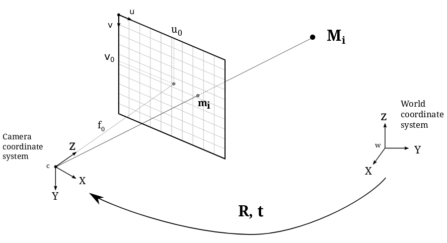
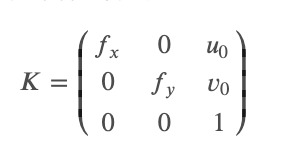

# Image Matching Challenge 2022

**Register two images from different viewpoints**

[Image Matching Challenge 2022 | Kaggle](https://www.kaggle.com/competitions/image-matching-challenge-2022)

## 比赛介绍

从**图像重建3D模型**，通常来说需要熟练的操作员在受控条件采集照片，来保证数据的均匀和高质量。本次比赛由Google Research主办，Google已经在谷歌地图上实现了**从普通街景和航拍图像创建3D模型**，其中使用最新的计算机视觉起到了关键的作用。本次比赛参赛选手就需要通过局部特征，捕获兴趣点周围的描述向量，以在两个或多个图像的图像位置的像素坐标之间建立对应关系。

* 竞赛类型：本次竞赛属于**计算机视觉/局部特征**，所以推荐使用的模型或者库：**DKM/SuperGlue/Kornia/QuadTreeAttention/Loftr**
* 赛题数据：在本次比赛数据是包含具有不同重叠程度的城市场景的照片。数据规模上，训练集包含5678多张图片；隐藏测试集中大约 包含10,000 对图像，但**测试数据与训练数据来源不同**。所有图像已调整大小，使最长边缘约为 800 像素，可能具有不同的纵横比（包括纵向和横向）。
* 评估标准：**mAA \(mean Average Accuracy\)**。参与者被要求估计一张图片相对于另一张图片的相对姿势。提交的数据根据评估姿势的 mAA 进行评估。给定一个fundamental matrix 和隐藏的 ground truth，我们依据旋转\(ϵR\\epsilon\_R , in degrees\) 和平移\(ϵT\\epsilon\_T , in meters\) 计算误差。给出每一个阈值，如果一个姿势同时满足两个阈值，我们就把它归类为准确的姿势。我们对10对阈值进行分类，每次一对（例如，在最细的级别上是1o1\^o和20厘米，在最粗的级别上是10o10\^o和5米）。 详见：[Image Matching Challenge 2022 | Kaggle](https://www.kaggle.com/competitions/image-matching-challenge-2022/overview/evaluation)
* 推荐阅读 Kaggle 内的一篇 EDA（探索数据分析）来获取一些预备知识：[imc2022-training-data | Kaggle](https://www.kaggle.com/code/eduardtrulls/imc2022-training-data)

## 数据说明

在本次比赛数据是包含具有不同重叠程度的城市场景的照片。数据规模上，训练集包含5678多张图片；隐藏测试集中大约 包含10,000 对图像，但**测试数据与训练数据来源不同**。所有图像已调整大小，使最长边缘约为 800 像素，可能具有不同的纵横比（包括纵向和横向）。

官方数据页面 [Image Matching Challenge 2022 | Kaggle](https://www.kaggle.com/competitions/image-matching-challenge-2022/data)

* train/\*/calibration.csv

  * image\_id - 图像文件名。
  * camera\_intrinsics - 图像的3\*3 **校准矩阵K**。通过行索引将其展平为向量。
  * rotation\_matrix - 图像的3\*3 **旋转矩阵R**。通过行索引将其展平为向量。
  * translation\_vector - **平移向量T**。

* train/\*/pair\_covisibility.csv

  * pair - 标识一对图像的字符串，编码为两个图像文件名（不带扩展名），由连字符分隔，如key1-key2, 其中key1> key2
  * covisibility - 估计两个图像之间的重叠。数字越大表示重叠越大。我们建议使用所有具有 0.1 或更高共可见性估计值的对
  * fundamental\_matrix - 来自校准文件的**targets列**。

* train/scaling\_factors.csv

  * 通过Structure-from-Motion重建的每个场景的姿势，并且只能精确到比例因子。该文件包含每个场景的标量，可用于将 它们转换为距离。

* train/\*/images

  * 在同一位置附近拍摄的图像。

* test.csv

  * sample\_id - 图像对的唯一标识符。
  * batch\_id - 批次编号。
  * image\_\[1/2\]\_id - 对中每个图像的文件名。

 

## 专业概念

比赛的目标是估计两幅图像之间的相对姿态。这需要一些关于**投影projective** 和 **对极几何epipolar geometry** 的知识，特别是关于以下方面。

* **calibration matrix 校准矩阵𝐊** 捕捉了决定三维点和二维（像素）坐标之间转换的相机属性。它也被称为**相机内参 camera intrinsics**。
* **rotation matrix 旋转矩阵𝐑** 和 **translation vector 平移矢量𝐓** 捕捉摄像机在全局参考框架中的 6自由度姿势（位置和方向）。它们被统称为 **相机外参 camera extrinsic** 。
* **fundamental matrix 基本矩阵𝐅** 封装了同一场景的两个视图之间的投影几何。它不受场景中内容的影响，只取决于两台摄像机的内参和外参。

训练数据提供了𝐊、𝐑和𝐓作为ground truth。参与者被要求估计𝐅。我们在下文中更详细地解释这些概念。

 

## Projective geometry 投影几何

在计算机视觉中，三维（世界）和二维（图像）之间的转换是由投影几何学来控制的。我们使用最简单的相机模型，即针孔相机的模型，如下图所示。

三维点𝐌𝐢，以米为单位，投影到二维坐标 mim\_i，以像素为单位，可以简单写成𝐦𝐢=𝐊𝐌𝐢，其中𝐊为校准矩阵。

其中𝑓𝑥,𝑓𝑦是对𝑥和𝑦的焦距，𝑢0，𝑣0是 **像主点偏移**  _principal point offsets_。图像没有径向畸变radial distortion。

请注意，这个方程只对相机（c）坐标系中的三维点有效。给定 "world"（w）坐标系中的点，以及由3×3旋转矩阵𝐑和3维平移矢量𝐓编码的位置上的摄像机，投影可以写成：

𝐦𝐢=𝐊\(𝐑𝐌𝐢+𝐓\)

请注意，我们所说的 "world"是指一个场景中不同摄像机之间共同的坐标系统，而不是绝对的（地理定位）。

 

### Epipolar geometry 对极几何

外极几何学是两个视图之间的投影几何学。它不依赖于场景的结构（内容）：它只依赖于相对姿势（外参）和相机内部参数（内参）。

在计算机视觉中，这种关系通常表示为fundamental matrix，一个2维的3×3矩阵。

给定一个三维点𝑀𝑖，以米为单位，其在两个不同相机上的投影 mim\_i和 mi′m'\_i，以像素为单位，这两个视图的基本矩阵𝐅必须满足mi′TFmi\=0m'\^T\_iFm\_i = 0。你可以用八点算法从一组稀疏的对应关系中计算出基本矩阵，或者用OpenCV或Kornia等库更实际地计算。

 

推荐相关课程：[Camera Calibration | Uncalibrated Stereo \- YouTube](https://www.youtube.com/playlist?list=PL2zRqk16wsdoCCLpou-dGo7QQNks1Ppzo)

 

## 解决方案思路

本次竞赛我们的方案是基于四个不同模型的匹配结果的融合。**LoFTR、SuperGlue、DKM 和 QuadTreeAttention**。它们都使用公开的预训练权重，没有经过训练或微调，原因是由于这次比赛的训练和测试数据的分布不同，我们认为这样做的效果会比较差。之后我们对调大了原始图像尺寸，来对不同模型进行适配，最终方案上各个模型分辨率分别保持在600-1600之间。最后我们concat所有模型输出的keypoints，并使用cv2.USAC\_MAGSAC来计算F矩阵。为了在kaggle规定的9个小时内完成四个模型的运算，我们使用了ThreadPoolExecutor，多线程的进行推理keypoints和计算F矩阵。此外，我们还尝试了Matchformerm模型、不同水平翻转数据增强等实验，但并没有起到效果。

#### 模型Ensemble

​x

def inf\_models\_ensemble\(image\_fpath\_1, image\_fpath\_2\):

 '''

 Input : image1 和 image2, 进行inference ensemble

 Return: match keypoints \(匹配关键点\)

 '''

 \# loftr

 k\_mkpts1, k\_mkpts2 \= loftr\_inference\(image\_fpath\_1, image\_fpath\_2, kornia\_max\_image\_size\) \# kornia\_max\_image\_size = 1024

 mkpts1\_merge \= k\_mkpts1

 mkpts2\_merge \= k\_mkpts2

 

 \#  QuadTreeAttention

 qta\_mkps1,qta\_mkps2 \= qta\_inference\(image\_fpath\_1, image\_fpath\_2, max\_image\_size\=qta\_max\_img\_size, divide\_coef\=32\) \# qta\_max\_img\_size = 1024

 mkpts1\_merge \= np.concatenate\(\(mkpts1\_merge, qta\_mkps1\), axis\=0\)

 mkpts2\_merge \= np.concatenate\(\(mkpts2\_merge, qta\_mkps2\), axis\=0\)

 

 \# SUPERGLUE

 sg\_mkpts1, sg\_mkpts2 \= superglue\_inference\(image\_fpath\_1, image\_fpath\_2\)

 mkpts1\_merge \= np.concatenate\(\(mkpts1\_merge, sg\_mkpts1\), axis\=0\)

 mkpts2\_merge \= np.concatenate\(\(mkpts2\_merge, sg\_mkpts2\), axis\=0\)

  

 \# DKM

 dkm\_mkpts1, dkm\_mkpts2, \_ \= dkm\_inference\(image\_fpath\_1, image\_fpath\_2\)

 if len\(dkm\_mkpts1\) \> 0:

 mkpts1\_merge \= np.concatenate\(\(mkpts1\_merge, dkm\_mkpts1\), axis\=0\)

 mkpts2\_merge \= np.concatenate\(\(mkpts2\_merge, dkm\_mkpts2\), axis\=0\)

  

 return mkpts1\_merge, mkpts2\_merge \# get match keypoints

 

#### 计算F矩阵

xxxxxxxxxx

def calc\_F\_matrix\(item\):

 '''

 Input : sample\_id, mkps1, mkps2 # 一对匹配关键点

 Return: F-matrix

 '''

 sample\_id, mkps1, mkps2 \= item 

  

 if len\(mkps1\) \> 7: \# 如果有足够的点, 则进行F-matrix计算

 F, \_ \= cv2.findFundamentalMat\(mkps1, mkps2, cv2.USAC\_MAGSAC, ransacReprojThreshold\=0.25, confidence\=0.999999, maxIters\=120\_000\)  \# 计算F-matrix

 else:   \# 如果没有足够的点, 则返回空的F-matrix

 F \= None 

  

 del mkps1, mkps2 \# clean up

 return sample\_id, F

 

## 比赛上分历程

1.  使用LoFTR模型直接推理，Public LB 0.726；
2.  对LoFTR进行调参（分辨率/keypoints数量/threshold等），Public LB 0.767；
3.  使用SuperGlue并调参，Public LB : 0.710；
4.  使用QTA并调参，Public LB : 0.799；
5.  使用DKM并调参，Public LB : 0.600；
6.  对四个模型结果进行融合，Public LB : 0.830+；
7.  对cv2.findFundamentalMat进行调参，Public LB : 0.840+；

 

## 代码、数据集

* 代码

  * IMC\_Inference.ipynb

* 数据集

  * datasets.txt

  * othermodels/

  * pywheels/

  * super-glue-pretrained-network/

 

## TL;DR

在这次竞赛中，参赛者将使用机器学习的方式，对同一场景下的不同角度拍摄的照片进行关键点匹配，并计算出 fundamental matrix。因为本次比赛的训练和测试数据的分布不同，所以我们使用了所有模型的预训练权重直接进行推理。我们最终方案使用了四个不同模型的匹配结果的融合。LoFTR、SuperGlue、DKM 和 QuadTreeAttention。我们还调整了原始图像尺寸，来对不同模型进行适配，各个模型分辨率分别保持在600-1600之间。为了在kaggle规定的9个小时内完成四个模型的运算，我们使用了ThreadPoolExecutor，多线程的进行推理keypoints和计算F矩阵，大幅加快了推理速度，最终我们获得了前1\%的成绩。
